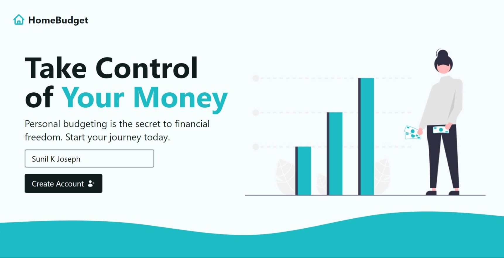
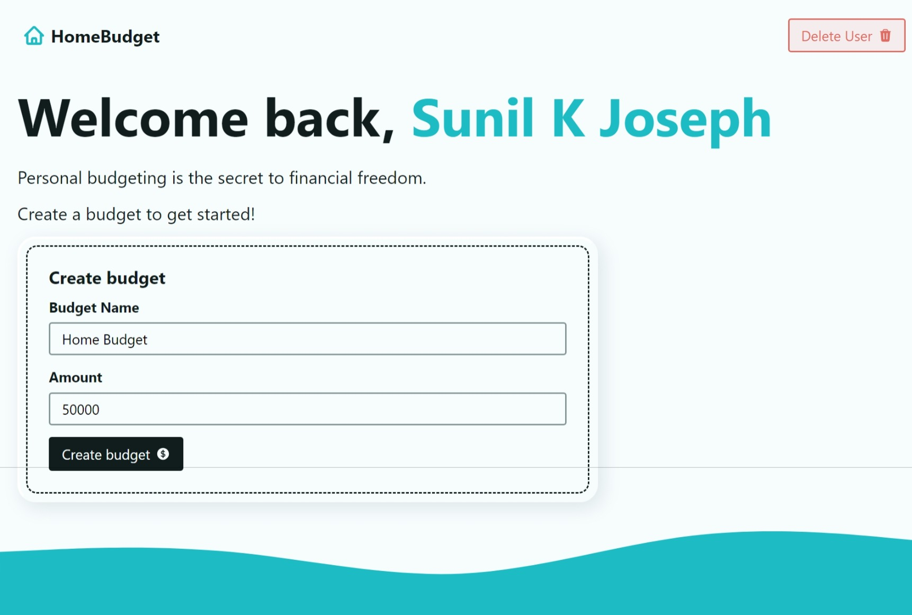
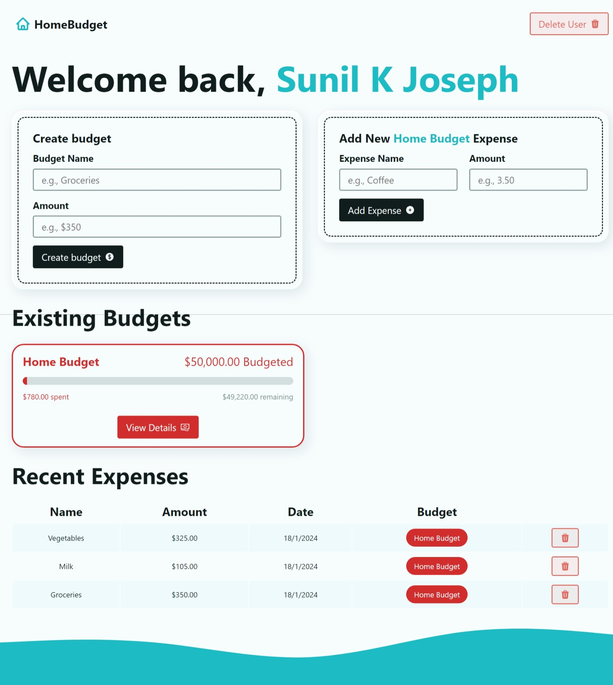

# React Budgeting Application

## Overview

The React Budgeting Application is a web application designed to help users manage their personal finances effectively. It provides a user-friendly interface for creating budgets, tracking expenses, and gaining insights into financial activities.

## Features

- **User Authentication**: Secure user authentication system to manage user accounts.
- **Budget Creation**: Create personalized budgets for various spending categories.
- **Expense Tracking**: Log and track individual expenses to stay within budget limits.
- **Data Visualization**: Visual representation of budget progress and expense breakdown.
- **Responsive Design**: Ensures a seamless experience across different devices.

## Usage

1. Sign up or log in to your account.
2. Create budgets for different spending categories.
3. Add individual expenses to track your spending.
4. Monitor budget progress and analyze expense patterns.
5. Log out to secure your account.

## Technologies Used
- React
- React Router DOM
- React Toastify

## Author

    Sunil K Joseph, Asst. Professor, Dept. of Computer Science, Mar Augusthinose College, Ramapuram.

## Screenshots

